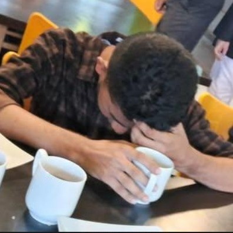

# Faizul Hai — Portfolio

> **haifaizul.github.io** — the personal portfolio of Faizul Hai.
> A "Memphis × Mathematics" one-pager, built from scratch with pure HTML / CSS / vanilla JS.
> No frameworks. No build step. No dependencies.

**Live site:** https://haifaizul.github.io
**Repo:** https://github.com/haifaizul/haifaizul.github.io

---

## Table of contents

- [What this is](#what-this-is)
- [File map](#file-map)
- [Getting started](#getting-started)
- [Deployment (GitHub Pages)](#deployment-github-pages)
- [Site structure](#site-structure)
- [Editing content](#editing-content)
- [Animation system](#animation-system)
- [Design system](#design-system)
- [Accessibility](#accessibility)
- [Common tasks](#common-tasks)
- [Troubleshooting](#troubleshooting)
- [Credits](#credits)

---

## What this is

A one-page portfolio introducing Faizul Hai as a *philomath in training to become a
polymath* — an A/L 2026 student (Mathematics, Physics, Chemistry) from Serendip
(Sri Lanka) who builds small tools and experiments in his spare time.

The design fuses the **Memphis Design** movement (1980s Milan — bold geometry,
squiggles, clashing colour blocks on paper backgrounds) with **mathematical motifs**
(the golden ratio, a constants ticker, a live age counter, coordinates).

Everything is intentionally hand-written:

- **No frameworks** (no React/Vue/Svelte)
- **No build step** (no webpack/vite/npm)
- **No external JS** (no jQuery, GSAP, AOS, etc.)
- **One HTML file, one CSS file, one JS file**

This makes the site trivially easy to host, edit, and understand. See
[`DESIGN.md`](./DESIGN.md) for the visual system and
[`docs/ANIMATIONS.md`](./docs/ANIMATIONS.md) for the animation reference.

---

## File map

| File | Purpose |
|------|---------|
| `index.html` | The entire page markup — all sections, all content |
| `style.css` | The full design system + animation CSS |
| `script.js` | All interactivity — animations, counters, cursor, easter eggs |
| `ads.txt` | AdSense verification file — **only needed if AdSense is used** |
| `.nojekyll` | Empty file; tells GitHub Pages "skip Jekyll, serve as-is" |
| `README.md` | This file — developer onboarding |
| `DESIGN.md` | Deep dive into the design system and visual language |
| `CONTRIBUTING.md` | How to contribute changes cleanly |
| `docs/ANIMATIONS.md` | Reference for every animation in the site |
| `CHANGELOG.md` | Version history |

There is intentionally **no** `package.json`, no `node_modules`, no build config.

---

## Getting started

Nothing to install. Serve the folder:

```bash
# Option 1 — open directly
open index.html        # macOS
xdg-open index.html    # Linux
start index.html       # Windows

# Option 2 — local server (recommended)
python3 -m http.server 8080
# → http://localhost:8080
```

> Google Fonts require internet; offline, the site falls back to system fonts.

---

## Deployment (GitHub Pages)

The site is served from the **`main` branch, repository root** via GitHub Pages
("Deploy from a branch" mode).

**To deploy a change:**

```bash
git add -A
git commit -m "describe your change"
git push origin main
```

Pages picks up the push automatically. Build takes ~1–5 minutes — check the
**Actions** tab → "Pages build and deployment" for status.

**If Pages is misconfigured:** repo → Settings → Pages → Source:
"Deploy from a branch", Branch: `main`, folder `/ (root)`.

**If deployment stays "queued":** cancel old queued builds in Actions (each
drag-and-drop upload creates one); make sure `index.html` is at the repo root;
make sure `.nojekyll` exists.

**Alternative — Actions workflow:** if branch-deploy misbehaves, switch Pages
source to "GitHub Actions" and add `.github/workflows/deploy.yml`:

```yaml
name: Deploy to Pages
on:
  push:
    branches: [main]
permissions:
  contents: read
  pages: write
  id-token: write
jobs:
  deploy:
    runs-on: ubuntu-latest
    steps:
      - uses: actions/checkout@v4
      - uses: actions/configure-pages@v5
      - uses: actions/upload-pages-artifact@v3
        with: { path: "." }
      - uses: actions/deploy-pages@v4
```

---

## Site structure

All markup lives in `index.html`, in this order:

| Block | ID / class | Contains |
|-------|-----------|----------|
| Preloader | `#preloader` | Fake "loading knowledge..." bar |
| Nav bar | `.nav` | FH logo, links, "say hi" CTA |
| Hero | `.hero` | Name scramble, tagline, golden ratio, stats, sine wave |
| Marquee 1 | `.marquee-cyan` | Subject ribbon (Math/Physics/Chem/Tech) |
| Marquee 2 | `.marquee-constants` | Constants ticker (π, e, φ, √2, c, h, i²) |
| About | `#about` | Portrait block + first-person bio + fact chips |
| Fields | `#fields` | 4 tilt cards: Math, Physics, Chemistry, Tech |
| Projects | `#projects` | 5 project cards linked to real repos |
| Contact | `#contact` | "LET'S BUILD SOMETHING" + social buttons + coords |
| Footer | `.footer` | Credit line + back-to-top button |
| Background | `.bg-shapes` / `.bg-dots` | Floating Memphis shapes + dotted paper |
| Cursor | `.cursor-dot` / `.cursor-ring` | Custom cursor (fine pointers only) |
| Progress | `#progress` | Scroll progress bar (4-colour gradient) |

**Featured projects** (all real repos): p6sims, strangernotes, kind-notes,
FLAMES, InterText. "Visit" links are sub-paths (`/p6sims/`) because those
projects also deploy under this Pages site; "Code" links point at the repos.

---

## Editing content

All content is plain HTML in `index.html` — no templates, no data files.

**Quick reference:**

- **Name / headline** — the `<span class="scramble" data-text="...">` elements
  in `.hero-title`. **Keep `data-text` in sync with the visible text** — the
  scramble animation types out the `data-text` value.
- **Tagline** — the `.hero-sub` paragraph.
- **Golden ratio** — `.hero-equation` block (`.eq` + `.eq-note`).
- **Stats** — `.stat` divs in `.hero-stats`; use `data-count="N"` for count-ups.
  `∞` is static by design.
- **Bio** — three `<p class="reveal">` in `.about-text`. Written in first person
  ("I'm / my") — keep it that way.
- **Fact chips** — `.chip` spans in `.fact-chips` (word, age, location, status).
- **Fields** — `.field-card` articles; copy one to add a field.
- **Projects** — `.project-card` articles; copy one and update links + the
  `c-*` colour class (`c-cyan`, `c-violet`, `c-magenta`, `c-lime`, `c-white`).
- **Socials** — the `.btn` links in `.contact-btns`.
- **Footer** — `.footer` spans.

**JS-maintained values (edit `script.js`, not HTML):**

- Age in days (`#age-chip`) and years (`#stat-age`) — from
  `BORN = new Date(2007, 8, 4)`.
- Rotating word wheel — `words` array in `script.js`.
- Location coordinates are hard-coded chips in HTML (currently Kalmunai).

**Add your photo (one-line swap):**

```html
<!-- replace these three lines -->
<!--  -->
<span class="portrait-fh">FH</span>
```

with:

```html

```

Put `photo.jpg` in the repo root. The frame is a square
(`aspect-ratio: 1/1`) — a square-ish crop works best. `.portrait-img` CSS
(`object-fit: cover`) already exists in `style.css`.

---

## Animation system

Full reference in [`docs/ANIMATIONS.md`](./docs/ANIMATIONS.md). Summary:

| Feature | Trigger | Mechanism |
|---------|---------|-----------|
| Preloader bar | page load | fake progress ticks; completes on `load` / 2.6 s failsafe |
| Text scramble | load | settles left→right over 28 frames |
| Rotating wheel | load | 2.6 s interval over word array |
| Custom cursor | mousemove | dot instant, ring lerps (0.16 factor) |
| Magnetic buttons | mousemove on `.magnetic` | pulls toward cursor |
| 3D tilt cards | mousemove on `.tilt` | max 7° rotateX/rotateY |
| Scroll reveals | IntersectionObserver | staggered via `--d` custom property |
| Count-up numbers | IO on `[data-count]` | eased cubic-out, 1.2 s |
| Marquees | CSS keyframes | duplicated tracks, pause on hover |
| Sine wave | load | JS builds the `d` path; dashed marching animation |
| Scroll progress | scroll | gradient bar width |
| Confetti easter egg | click on FH logo | math symbols burst from cursor |

**Rules:** `prefers-reduced-motion` is respected globally. If you add an
animation, respect it too. If you add a marquee, duplicate the track content.
The scramble's `data-text` must match the visible text.

---

## Design system

Full deep-dive in [`DESIGN.md`](./DESIGN.md). Short version:

- **Palette** (`:root` in `style.css`): paper `#FBF6EC`, ink `#16130F`,
  cyan `#00B8F0`, violet `#7C4DFF`, magenta `#FF2E9A`, lime `#B8F000`, white.
- **Fonts:** Archivo Black (display), Space Grotesk (body), Space Mono (labels) —
  Google Fonts with system fallbacks.
- **Signature details:** 2 px ink borders, hard offset shadows
  (`6px 6px 0 var(--ink)`), slight rotations (±8° max), squiggle SVGs, dotted
  paper texture, tape-sticker chips.
- **Rule of thumb:** hard shadows for depth, never soft blur shadows on the
  Memphis elements; accent colours used as solid blocks.

---

## Accessibility

- Semantic landmarks (`header`, `main`, `section`, `footer`, `nav`).
- `aria-hidden="true"` on decorative elements.
- Visible `:focus-visible` outline (violet).
- Full `prefers-reduced-motion` support.
- High contrast (ink on paper, white on violet/magenta).
- Custom cursor disabled on touch devices and under reduced motion.
- `<noscript>` styles keep content visible without JS.

---

## Common tasks

**Add a project card** — copy a `.project-card`, change icon/title/description/
links/`c-*` class. Add `<a href="/name/">visit ↗</a>` if it has a live demo here.

**Change accent colours** — edit the CSS custom properties in `:root`; check the
gradient uses (progress bar, logo block, portrait block, preloader bar).

**Add a marquee** — add `.marquee` + `.marquee-track` whose content appears
twice; add a background class (`marquee-cyan`, `marquee-constants`, ...).

**Change birthdate** — edit `BORN` in `script.js`; days chip and years stat
update automatically.

**Add a social** — add `<a class="btn btn-COLOR magnetic">` to `.contact-btns`.

---

## Troubleshooting

| Symptom | Likely cause / fix |
|---------|--------------------|
| Fonts look plain | Offline — Google Fonts blocked. Fine in production. |
| Marquee jumps | Track content not duplicated (see ANIMATIONS.md). |
| Scramble shows wrong word | `data-text` out of sync with visible text. |
| Age is wrong | `BORN` in `script.js`. |
| Site not updating | Hard-refresh (Ctrl/Cmd+Shift+R); check Actions; check root. |
| Deployment "queued" forever | Cancel old builds; root-level index.html; `.nojekyll`. |
| `.reveal` content invisible | JS failed — check console; `<noscript>` styles should show it. |
| Cursor missing | Touch device or reduced motion — by design. |

---

## Credits

- Design concept: **Memphis Design × mathematics**, hand-built for Faizul Hai.
- Fonts: Archivo Black, Space Grotesk, Space Mono (Google Fonts).
- No frameworks, no libraries, no build tools — just HTML, CSS, JS and curiosity.
- Built with 💛 + an AI agent, in Serendip.
